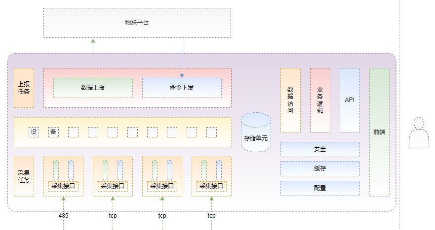
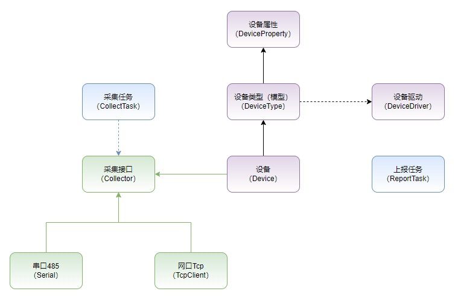
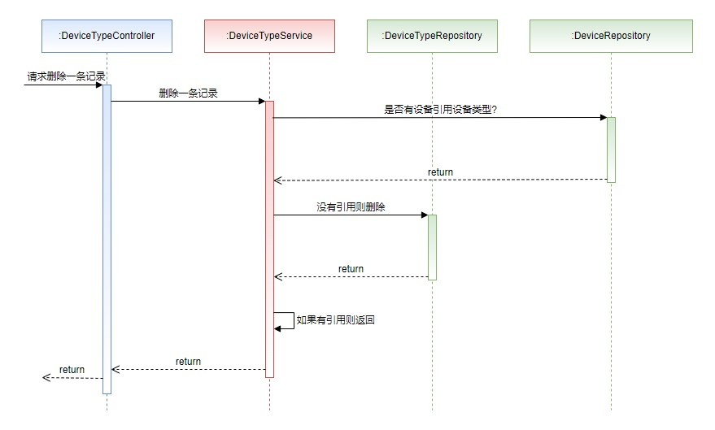
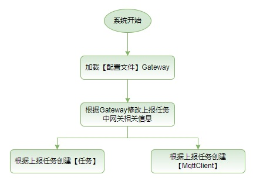

## 一、项目名称 smartgw(smart gateway)

> 物联网网关，用来实现通过485、网桥（485-tcp）进行数据采集、上报（到物联平台）、命令下发等功能。

> 依赖：upx.exe 用于压缩go的可执行程序

> 支持平台：thingsboard 3.6.1 (目前测试版本，之前测试 3.3.1及以上版本) 

## 二、系统架构
###（一）系统架构
#### 1、架构图

#### 2、架构说明

> 系统由三部分组成：工作单元、存储单元、运维单元
>    ```
>    1、工作单元
>       工作单元主要实现数据采集、数据上报、命令下发等功能
>    2、存储单元
>       存储网关运行相关的各种配置数据：采集接口、网口、设备类型、设备清单、采集任务、上报任务等内容。
>    3、运维单元
>       主要包含: 基础数据维护（采集接口、网口、设备类型、设备清单）、任务计划（采集任务、上报任务）调试服务(接口调试、系统升级）
>    ```
###（二）领域模型


> 领域模型缺少网口信息

###（三）时序图

#### 4、WebApi
具体内容请 [查看](./doc/ts004 WebApi.md)
###（四）启动流程

```
1、在物联平台添加网关 GW001
2、修改配置文件config/config.yml中的网关信息
3、运行后台程序
```


## 三、技术选型
1. 依赖注入
```
使用uber的fx实现依赖注入功能
```
2. 配置文件
```
使用viper读取yml文件，（配置文件热修改未实现...）
```
3. 日志管理
```
使用uber的zap日志实现
```
4. 数据库
```
使用boltdb（k，v型非关系数据库）
```
5. 文件操作: 自定义操作
6. web服务器: [gin 文档](https://pkg.go.dev/github.com/gin-gonic/gin)
```
中间件
1、JWTToken
2、异常恢复
3、文件上传
```
7. 任务调度：cron
## 四、任务
```
1、首页

2、基础数据
    （1）采集接口
    （2）设备类型（物模型）
    （3）设备清单
2、任务计划
    （1）采集任务
    （2）上报任务(mqtt)
3、运维服务
    （1）系统升级
    （2）操作说明
    （3）更新日志
```
## 五、开发
1. 编译运行后端
```
go run main.go
```
2. 编译运行前端
```
cd webapp
npm install // 安装依赖库
运行...
npm run dev
```
## 六、产品
1. 编译后端
```
    同上
```
2. 编译前端
```
cd webapp
npm run build:prod
```
经过以前编译，webapp下的vue前端，将被生成到webroot目录下
## 七、部署（arm系统）
```
1、编译前端生成webroot目录（见上）

2、运行 build-arm.bat生成release目录

3、拷贝release下文件到目标系统（/home/smartgw)
/
+ smartgw         // 可执行程序，需要执行 chmod +x smartgw
+ config            // 配置文件目录
  + config.yml      // 配置文件
+ webroot           // web页面

4、需要在/etc/rc.local中配置
   1、网关ip地址
   2、引导 /home/smartgw
5、运行前配置 config.yml 中的内容
```

